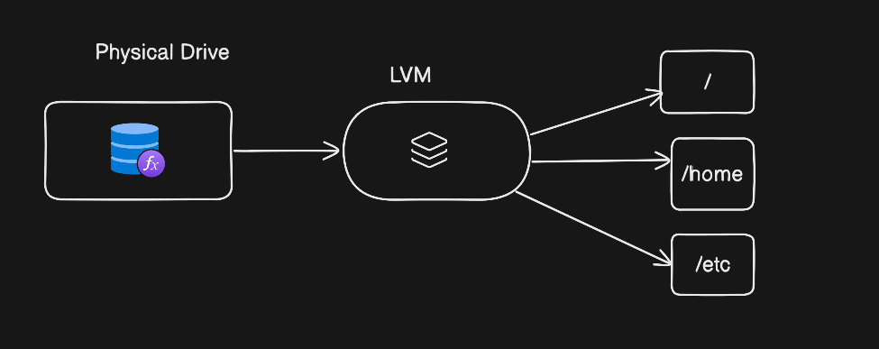

# Definition
 <br>

Logically partitioning of a drive or mount in different mounting points or combining multiple disks into 1 mounting group. <br>
*Example:* Let's say we have 1 TB storage in our laptop, Then we assign some amount of storage to root,some /etc and some to /home.
In another case 3 disks of 1-1 TB are created and combined into one disk of 3 tb. <br>
**Note:** Disk space can be enhanced and reduced according to the needs using LVM

## Steps of LVM
1. Attach a physical or virtual drive drive
2. make partitions to use it
3. Designate physical volume
4. Manage volume group
5. manage logical volume
6. assign to a mounting location or folder
7. Set mount point

### Attach physical volume
```bash
fdisk -l //check if you can see the attached disk size
```
### Partitioning new disk
```bash
fdisk /dev/sdb    // /dev/sdb is mount point where disk is attached, you will enter into fdisk promt then choose the steps
# press n to create new partition for disk /dev/sdb
# Press p for primary rather than extended
# change the type of partition from linux to linux LVM by pressing T
# Write table to disk and exit
```
### Designate physical volume
```bash
pvcreate /dev/sdb1
pvdisplay
```
### create volume group
```bash
vgcreate volumeGroupName /dev/sdb1
vgdisplay volumeGroupName
```
### create LVM
```bash
lvcreate -L 1000M -n lvName volumeGroupName //created 1gb of lv of lvname from volumegroup
lvdisplay
```
### Mount volumes to a folder and apply filesystem
```bash
mkfs.ext4 /dev/volumeGroupName/lvName //assigned filesystem to lv
mkdir /folderName //on which the lv is going to be mounted
mount /dev/volumeGroupName/lvname /folderName //mounted volume to the folder temporarely
df -Th //check files mounting 
cat /etc/mtab // check for the mounting locations
vi /etc/fstab // pate the lines copied from mtab and make defaults to make the mouinting parmanent
mount -av //check for mountings
```
### extending volumes from LV
```bash
vgextend volumeGroupName /dev/sdc1 //After attaching 1 gb of harddrive making partitions the extended our volumegroup by 1 gb
lvextend -L +1000M /dev/volumeGroupName/lvName //assigned 1 db of volume to our lv
resize2fs /dev/vgName/lvname 2gb //Now I want my logical volume to be of 2 gb in total for ext4 file type and for xfs we have different command
```


